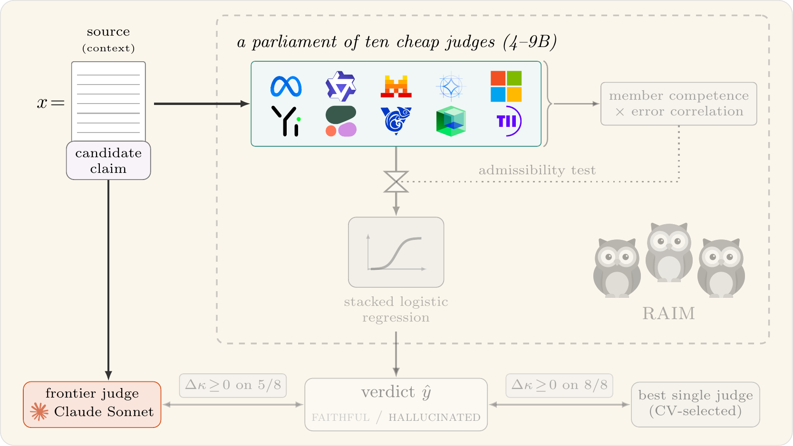

# RAIM-verdicts — the measurement instrument and the released judgements

[](LICENSE)
[](https://arxiv.org/abs/2609.39229)
[](https://github.com/eOnofri04/raim-analysis)
[](#artefact-zones)

This is the measurement half of the companion code for the paper:

> **RAIM: Robust Aggregation of Inexpensive Models for Hallucination Detection**  
> Elia Onofri and Roberto Di Pietro  
> _Computer, Electrical and Mathematical Sciences and Engineering (CEMSE) Division, King Abdullah University of Science and Technology (KAUST), Thuwal, Saudi Arabia_  
> [arXiv:2609.39229](https://arxiv.org/abs/2609.39229)



_Figure 1 of the paper, redrawn.
In colour, what this repository reads and produces: the benchmark item, the panel of ten judges, and the frontier judge, both reading that item; [`raim-analysis`](https://github.com/eOnofri04/raim-analysis) covers the rest, in grey._

| Frontier quality retained | Cost per 1,000 items | Break-even against the API |
|---|---|---|
| a median 93% of Claude Sonnet's Cohen's κ, giving up 2.9 points of balanced accuracy on average | \$0.039 against \$2.52, some 64× cheaper | 40,309 to 80,618 items, for a one-time calibration of 50 to 100 labelled records |

_The paper's headline numbers; `make numbers` in [`raim-analysis`](https://github.com/eOnofri04/raim-analysis) prints each beside the file and key it is read from._

Large language models are increasingly used as automatic judges of whether a generated response is faithful to its source, yet the strongest judges are proprietary and costly to run at scale.
RAIM asks whether a panel of cheap, open-weight small judges —ten models between 4 and 9 billion parameters— can be aggregated into a viable alternative to a single strong judge, and, more usefully, *when* it can.
This repository is the instrument that produces the evidence: it runs the panel and a set of reference judges over eight faithfulness benchmarks, and records what each judge said about each item.

Everything here costs GPU hours or paid API calls, and inference is not bit-reproducible across GPU model or vLLM version, so the judgements it emits are **data, not a build product**.
Its companion, [`raim-analysis`](https://github.com/eOnofri04/raim-analysis), holds everything that regenerates deterministically from those judgements on a laptop, at `seed=0`, in minutes: the stacked aggregator, the bootstrap machinery, and the table and figure generators.

> **Which repository do you need?**
> Most readers want `raim-analysis`: the judgements it reads sit in its `verdicts/`, and every number, table and figure in the paper regenerates from them without a GPU.
> Come here to inspect the judgements themselves (`runs/`, generated text included), to verify how items map back to their source rows, to re-run the panel on your own hardware, or to judge a new dataset.

The cut between the two is **irreproducible-for-a-reader versus reproducible-from-data**; consequently, this repository includes, along with the obvious GPU-gated calls, the API judge calls, which are cheap in compute but money-gated and non-deterministic.
The paper's _Code and data availability_ section gives a general overview of both repositories.

The handoff between the two (`make export`, `tools/export_votes.py --check`) expects them cloned side by side:

```bash
git clone https://github.com/eOnofri04/raim-verdicts.git
git clone https://github.com/eOnofri04/raim-analysis.git
```

`QUICKSTART.md` is the short version of this page: whether you need this repository at all, and the three commands that check a checkout.

## Table of contents

1. [What this repository produces](#what-this-repository-produces)
2. [Repository layout](#repository-layout)
3. [Installation](#installation)
4. [The panel](#the-panel)
5. [The datasets and the join](#the-datasets-and-the-join)
6. [Command reference](#command-reference)
7. [Artefact zones](#artefact-zones)
8. [Verifying this release](#verifying-this-release)
9. [Citation](#citation)
10. [Licence](#licence)
11. [Contact](#contact)

## What this repository produces

Three things, in descending order of cost.

- **Panel judgements** — the ten-member panel's binary call on every instance of eight benchmarks, at `runs/<dataset>/experiment.jsonl`.
  This is the study's primary measurement and the expensive one.
  Beside it on the four LLM-AggreFact sets sits the frame contrast the paper reports (`experiment_defon.jsonl`).
- **Reference judges** — the frontier API judge (Claude Sonnet), an open scaling ladder (Qwen 32B and 72B AWQ), the purpose-trained judges (Prometheus 2, JudgeLM, Auto-J), the MiniCheck specialists, and a constrained log-probability scorer used for the base-versus-instruct probe.
- **The join index** — `dataset_index/`, a content-addressed mapping from every released judgement to the source row it was taken on.

A judgement record carries the instance and model identifiers, the gold label, the stratum and category, the content-addressed join key, the condition and format, the parsed prediction and the raw generation — and **no document, question or candidate text**.
That is the release's central advantage: we publish our own measurements rather than redistributing MedHallu, RAGTruth or LLM-AggreFact.
It also means the release is worthless unless a third party can reconstruct the join, which is what `dataset_index/` exists for.

## Repository layout

```
raim/
  tasks.py           # the eight dataset builders, revision-pinned; instance schema
  prompts.py         # the conditions (def_on / claimcheck) and verdict parsing
  backends.py        # vLLM, Anthropic and mock backends; constrained scoring
  panel.py           # the frozen ten-member roster and the sharded run loop
  pt_judges.py       # native adapters for Prometheus-2, JudgeLM and Auto-J
  suite.py           # the eight datasets, their frames, and the named arm-sets — one table
  legs.py            # every reference judge as a registry row, and the sweep over them
  guard.py           # the one rule: never write over a measurement you did not ask for
  scoring.py         # the frozen paired cluster-bootstrap estimator, in one place
  analysis.py        # on-box diagnostic readout for scripts/run.py (not the paper's analysis)
  ci.py              # percentile interval helper, in the project's [point, lo, hi] convention
  experimental.py    # @experimental / @deprecated: non-silent markers (see the note below)

scripts/                  # THE MEASUREMENT ENTRY POINTS -- one experiment or one worker each
  run.py                  # the panel over one dataset, by arm-set; sharded and resumable
  run_judge.py            # one judge (API or open-weight) over a dataset, with usage and cost
  run_lpscore.py          # constrained forced-choice scorer, one model over one dataset
  run_ptjudge.py          # the purpose-trained judges, through their native adapters
  run_minicheck.py        # the MiniCheck specialists, through the official package (own venv)

  run_panel.sh            # THE PANEL, one arm per dataset, each under its own frame
  run_judge.sh            # EVERY REFERENCE JUDGE, LEG= selects one, a family, or all
  run_contrast.sh         # the def_on-on-AggreFact frame contrast, panel and judge
  run_scorer.sh           # the constrained scorer: the base-versus-instruct probe

tools/                 # PROVENANCE AND QUALITY CONTROL -- not measurement, doesn't touch the panel
  assemble_panel.py     # concatenates scorer member files into a panel, behind the gate
  fetch_factscore.py    # obtains and verifies the one source file not shipped here
  dataset_index.py      # writes dataset_index/ — the authoritative join mapping
  joincheck.py          # verifies a rebuild against that index; the provenance gate
  coverage_check.py     # per-model coverage gate; exits non-zero below --min
  coverage_report.py    # the same across every dataset under runs/, as markdown
  verdict_lock.py       # checksums the verdict tree; writes and verifies verdicts.lock.json
  export_votes.py       # projects the verdict tree into raim-analysis — the handoff
  compare_runs.py       # diffs two verdict trees, for cross-box confirmation

diagnostics/            # one-off tools; none writes to the verdict tree
  inspect_prompt.py      # one instance through the panel, printing prompts and raw outputs
  bench_throughput.py    # sustained items/sec, feeding the analysis repository's cost table

tests/                  # offline, no GPU/network
  test_matcher.py        # the Yes/No matcher
  test_constrained.py    # constrained decoding
  test_panel_atomic.py   # a failed run never destroys an existing verdict file

Makefile           # the verification and handoff targets; `make check` is the standalone check
verdicts.lock.json # one sha256 per released verdict file + the release digest
dataset_index/     # 7,670 records mapping every judgement to its source row
runs/              # the released judgements themselves, 284 files, 167 MB
datasets/          # empty: where FActScore's file goes; see tools/fetch_factscore.py
```

> **Note on `@experimental` / `@deprecated`.**
> A few components carry one of these two decorators from `raim/experimental.py`, and both warn loudly by design rather than sit silently in code a reader might otherwise trust.  
> `@experimental` marks code with a known caveat, which the warning names (currently the JudgeLM score parser behind `raim.pt_judges.get_judge`);  
> `@deprecated` marks retired code kept only as a named target for a regression test (the pre-constrained-decoding scorer algorithms in `raim/backends.py`).  
> Both can be silenced globally — `DISABLE_EXPERIMENTAL_WARNINGS=1` / `DISABLE_DEPRECATED_WARNINGS=1` — once the reason for the warning no longer applies to you.

> **Note on `runs/`.**
> `runs/` holds the released judgements, and every file in it is pinned by `verdicts.lock.json`.
> A re-run writes into the same tree, so measure into a copy (or point the scripts at another tree) if you want to keep the released files as they are; `make lockcheck` tells you whether they still are.

## Installation

The dependency set is kept small and layered so a machine installs only what it will actually run.

```bash
python3 -m venv .venv
.venv/bin/pip install -r requirements-core.txt      # numpy, scikit-learn, datasets
.venv/bin/pip install -e .                          # raim itself, importable from any directory
export PY=$PWD/.venv/bin/python3                    # the interpreter every command below uses
make runs PY=$PY                                    # unpack runs.tar.xz into runs/ and verify it
```

That is enough to build every dataset, verify the join, verify the released judgements, run the mock panel, and execute the offline test suites.
FActScore is the one exception: building it, and hence `tools/joincheck.py` and `make check`, first needs its annotation file, which is not redistributed here; `$PY tools/fetch_factscore.py` gives the download route and verifies the result (see [Licence](#licence)).
The editable install is what lets `tests/` and `diagnostics/` `import raim` without living next to the package; every orchestration script still resolves its interpreter explicitly (see below), so this is the only place an activated environment matters.
The heavy dependencies are imported lazily, inside the methods that need them, so an import never drags in a runtime the caller was not going to use.

| tier | packages | needed for |
|---|---|---|
| core | `numpy`, `scikit-learn`, `datasets` | everything below, plus the builders and `tools/joincheck.py` |
| local inference | `vllm`, `transformers` | the panel, the scorer, the open judges — a GPU box only |
| paid judge | `anthropic` | Claude, through its SDK |
| specialists | the `minicheck` package | `scripts/run_minicheck.py` only, and in **its own** virtual environment |
| optional | `matplotlib` | `scripts/run.py`'s diagnostic PNGs; absent, it says so and carries on |

`datasets` is pinned rather than bounded.
A newer release could alter row ordering or split handling by itself, and since every instance identifier is positional over the loaded rows, that would silently re-point the join.

One dataset source (`lytang/LLM-AggreFact`, behind the four AggreFact sets) is gated on Hugging Face, so `export HF_TOKEN=...` before a cold build; the Llama-3.1 and gemma-2 weights are gated too, so accept their licences before running the panel.

> **Note on the interpreter.**
> Every orchestration script, like the `Makefile`, resolves its interpreter as `$PY` when set, and otherwise as the `.venv` the install block above creates, falling back to the `python3` on `PATH` only when there is none.
> It then calls `"$PY"`, never a bare `python`, so none of them depends on an activated environment.
> Override with `PY=... bash scripts/run_x.sh`.

> **Note on platforms.**
> The procedures here were tested on macOS (Python 3.13) and on two Linux machines (Python 3.12 and 3.14).
> The Makefiles and shell scripts assume a POSIX shell, so on Windows run them under WSL; native Windows is untested.

## The panel

Ten cheap (4–9 B) open **instruct** models, defined in `raim/panel.py`.
**The order is load-bearing** — shards are cached by index, so members must never be reordered.

| idx | model | lineage / note |
|----|-------|----------------|
| 00 | `meta-llama/Llama-3.1-8B-Instruct` | Meta |
| 01 | `Qwen/Qwen2.5-7B-Instruct` | Alibaba |
| 02 | `mistralai/Mistral-7B-Instruct-v0.3` | Mistral |
| 03 | `google/gemma-2-9b-it` | Google |
| 04 | `microsoft/Phi-4-mini-instruct` | Microsoft |
| 05 | `01-ai/Yi-1.5-9B-Chat-16K` | 01.AI; 16K |
| 06 | `CohereLabs/c4ai-command-r7b-12-2024` | Cohere; 8192 native, RAG-tuned |
| 07 | `zai-org/glm-4-9b-chat-hf` | Zhipu/Z.ai; 128K |
| 08 | `ibm-granite/granite-3.3-8b-instruct` | IBM; 128K |
| 09 | `tiiuae/Falcon3-7B-Instruct` | TII; 32K |

The roster is identical, and identically ordered, across all eight datasets.
The members were chosen a priori for decorrelated lineage —distinct families, all with at least 8192 tokens of native context, so none truncates more than the panel's 8192 cap— rather than by selection on the outcome.

## The datasets and the join

Eight benchmarks, each reduced to balanced binary detection: every source row yields one supported instance and one hallucinated one, paired under a shared cluster identifier so the cluster bootstrap downstream can respect the dependence.

| dataset | n | clusters | frame | axis |
|---|---|---|---|---|
| `medhallu` | 2000 | 1000 | `def_on` | grounded, core |
| `ragtruth` | 1362 | 681 | `def_on` | grounded, core |
| `aggrefact_xsum` | 546 | 472 | claim-support | grounded, core |
| `aggrefact_wice` | 222 | 221 | claim-support | grounded, core |
| `aggrefact_cnn` | 114 | 109 | claim-support | grounded, secondary |
| `aggrefact_expertqa` | 1462 | 1360 | claim-support | grounded, secondary |
| `truthfulqa` | 1634 | 817 | `def_on` | ungrounded contrast |
| `factscore` | 330 | 165 | `def_on` | ungrounded contrast |

The four QA-form sets sit at exactly n/2 clusters, one per source row.
The four LLM-AggreFact sets do not, because there a cluster is a document and some documents carry several claims — which is precisely what the cluster bootstrap relies on.

> **Note on the frame.**
> The four LLM-AggreFact sets are scored under a claim-support frame rather than `def_on`, because their builders make the question and the candidate coincide, so the shared `def_on` prompt would show the claim twice and misframe a claim-verification task.
> The pipeline detects the frame per dataset; do not override it.

### The provenance chain, closed on three independent legs

Both instance identifiers are positional artefacts of a seeded shuffle over the loaded rows.
Left unpinned, an upstream revision would re-point every instance silently: nothing raises, the numbers still compute, and they are wrong.
Three separate mechanisms close that hazard, and each would catch a failure the others might miss.

- **A pinned revision.**
  `DATASET_REVISIONS` in `raim/tasks.py` pins all four Hub sources by commit SHA, reached by every builder through `revision_of`.
  FActScore has no Hub revision, being a file fetched by hand, so it is pinned by **checksum** instead: `FACTSCORE_SHA256` guards `datasets/InstructGPT.jsonl`, and the builder fails loudly with both digests on a mismatch.
  That gap is the sharper one, since a FActScore instance identifier is the line number of whatever file the path names, and the sibling releases share its schema exactly — so a substitution would produce 330 plausible instances joined to entirely different biographies.
- **A deterministic seeded builder.**
  Rebuilding at `seed=0` reproduces the same instances in the same order; this was confirmed on three machines, under macOS and Ubuntu.
- **A content-addressed index.**
  `dataset_index/` records, per released instance, the positional keys together with a hash over question, context items and candidate.
  Every newly emitted judgement carries that same key, from the single definition on `Instance`, so a new verdict file is self-joining; the released runs predate the field, and join through the index.
  It verifies content rather than trusting a pointer, so it survives a dataset being revised, gated or withdrawn.
  There are 7,670 records and **zero duplicate content keys in any dataset**, so that hash uniquely identifies every released item.

This index, not any upstream snapshot, is the authoritative mapping.
A third party recomputes the hash from the source datasets and verifies the join without our redistributing any source text.

## Command reference

Roughly in execution order; nothing runs automatically.

One script per experiment, each named for what it measures.
Every one of them resolves each dataset's frame itself, skips work already done under the right frame, and refuses to overwrite a measurement taken under a different one — so nothing below needs telling which datasets take which frame, and `FORCE=1` can redo a measurement but never blow through a mismatch.

**Every file in the verdict tree is the output of exactly one of these commands**, with no flags to remember:

| file | command | arms | datasets |
|---|---|---|---|
| `<ds>/experiment.jsonl` | `bash scripts/run_panel.sh` | `def_on` \| `claimcheck` | all eight |
| `<ds>/experiment_defon.jsonl` | `bash scripts/run_contrast.sh` | `def_on` | the four LLM-AggreFact |
| `<ds>/judge_<tag>.{jsonl,json}` | `LEG=<leg> bash scripts/run_judge.sh` | the dataset's own frame | per leg |
| `<ds>/judge_sonnet_defon.{jsonl,json}` | `bash scripts/run_contrast.sh` | `def_on` | the four LLM-AggreFact |
| `lp_probe/<ds>_*_v3*.jsonl` | `bash scripts/run_scorer.sh` | forced-choice scorer | all eight |

### The panel — the study's spine

```bash
bash scripts/run_panel.sh                                                 # all eight datasets, GPU
$PY scripts/run.py --dataset medhallu --backend vllm --gpu-util 0.90      # one of them
```

→ `runs/<ds>/experiment.jsonl`, sharded and resumable, one arm per dataset.

### Reference judges

```bash
bash scripts/run_judge.sh                        # list every leg and whether its prerequisites are met here
LEG=sonnet bash scripts/run_judge.sh             # the frontier judge; API only, no GPU
LEG=oss    bash scripts/run_judge.sh             # the Qwen 32B + 72B AWQ ladder, 2-card box
LEG=pt     bash scripts/run_judge.sh             # Prometheus-2, JudgeLM, Auto-J
LEG=specialist bash scripts/run_judge.sh         # MiniCheck-Flan-T5, Bespoke-MiniCheck (own venv)
LEG=all PLAN=1 bash scripts/run_judge.sh         # what a full pass would do, running nothing
```

→ `runs/<ds>/judge_<tag>.{jsonl,json}`, the JSON carrying measured usage and cost blocks for the paid judge.

> **Note on there being no default.**
> A bare `bash scripts/run_judge.sh` prints the registry rather than running anything: `LEG=all` is real money and real GPU hours, so it is a sentence someone has to type.
> `PLAN=1` prints the exact invocations a run would make, which is the cheap way to check a box's state before spending on it.
> On a tree that already holds every measurement, as the released one does, it prints only `[skip]` lines, since nothing is left to run.
> Please notice that `ready`, in the registry, means that a leg's API key or interpreter is in place; it does not check for a GPU.

> **Note on tags.**
> Each leg's `--tag` is fixed in the registry (`raim/legs.py`), so two judges cannot land on one another's files through `scripts/run_judge.sh`.
> Driving `scripts/run_judge.py` directly, `--tag` defaults to the *backend* name; a file already recorded for a different judge model is then refused rather than overwritten or skipped, so name `--tag` explicitly for a second judge on the same backend.

### Additional experiments

```bash
bash scripts/run_contrast.sh        # def_on on the AggreFact four: the panel and Sonnet
bash scripts/run_scorer.sh          # the constrained scorer: the base-versus-instruct probe
```

`scripts/run_contrast.sh` measures the *wrong* frame on purpose, for the frame contrast the paper reports (Appendix F, *Comparability with published results*, and its table `tab_frame`); everything it writes carries a `_defon` name so the scoring layer cannot reach it.

`scripts/run_scorer.sh` scores the eight matched base/instruct twins under constrained decoding, and assembles a base and an instruct panel per dataset behind the gate (`tools/assemble_panel.py`).
→ `runs/lp_probe/<ds>_lp{base,inst}_v3_panel.jsonl`, written only if every member passes.
A log of nothing but `[skip] … already holds` is a complete pass, not a stalled one.

### Provenance and quality control

```bash
$PY tools/joincheck.py                       # offline: rebuild vs the committed index
$PY tools/joincheck.py --vs-verdicts         # ... and against the released judgements in runs/
$PY tools/joincheck.py --online              # fetch, at the pinned revisions: do the pins still hold?
$PY tools/joincheck.py --unpinned            # at current upstream: has it drifted? needs HF_TOKEN and a cold cache
$PY -m raim.guard --scan runs                # every panel and judge file holds its expected frame
$PY tools/coverage_report.py --expect 10     # per-model coverage across every dataset under runs/
```

> **Note on the two online modes.**
> `--online` resolves the pinned revisions, and so asks whether those pins still hold.
> `--unpinned` ignores them and resolves each source at its current default branch, and so asks whether upstream has moved since the reported runs.
> They are different questions, and only the second is a drift test.

> **`tools/dataset_index.py` writes the index; it is not a check.**
> It refuses to overwrite an existing `dataset_index/` without `--force`.
> To check the index, use `make indexcheck` (a rebuild in a throwaway copy) or `tools/joincheck.py`.

### Offline smoke tests

```bash
$PY scripts/run.py --dataset medhallu --backend mock --synthetic --limit 40
$PY tests/test_matcher.py && $PY tests/test_constrained.py
```

No GPU, no network, seconds.
A mock or synthetic panel run defaults to `.smoke/`, never `runs/`, so it cannot replace a real verdict file.

## Artefact zones

Four zones, with a retention policy each.
The first belongs to this repository; the rest to `raim-analysis`.

| zone | contents | reproducible? | where |
|---|---|---|---|
| 1. this repository's output | verdict files, `dataset_index/` | no: GPU hours and API spend | `runs/`, `dataset_index/` |
| 2. the analysis repository's input | the votes-only projection of zone 1 | from zone 1, by `make export` | `raim-analysis/verdicts/` |
| 3. derived | the JSONs the paper build reads | yes: seeded, reproducible to float drift | `raim-analysis/derived/` |
| 4. terminal output | tables, figures | yes | regenerated by `raim-analysis` |

`runs/` holds the 284 verdict files released with the paper (220 verdict files and the 64 judge summaries beside them, 167 MB), generated text included.
They are committed compressed, as `runs.tar.xz` (about 8 MB), and `make runs` unpacks them into `runs/`, which git ignores, before checking the result against `verdicts.lock.json`.

`dataset_index/` (1.3 MB) is what makes the judgements meaningful at all, and is therefore committed uncompressed, readable without unpacking anything.

`verdicts.lock.json` is the checksum pin: one sha256 per verdict file, plus a `release_digest` naming the whole release in one string, and the digest of the join index it was taken against.

```bash
make lockcheck PY=.venv/bin/python3   # the released tree against its lockfile
make lock      PY=.venv/bin/python3   # after a measurement run of your own
```

It answers a question that a two-repository split otherwise leaves unanswerable: *which data release produced this table?*.
It also closes a matching hazard: a verdict file amended, truncated or half-copied between one analysis run and the next would otherwise be undetectable.
`--check` reports missing, changed and untracked files separately and exits non-zero on the first two.
`make lock` refuses to re-pin a tree that is missing recorded files or whose recorded files changed content, unless forced.

### The handoff

**Nothing here imports or invokes the analysis repository**, and no measurement pipeline writes into it.
Every pipeline stops at its last measurement artefact and says what to run next.

The one deliberate exception is the handoff itself.

```bash
make lock      # a checksummed identity for what was measured
make export    # project it into ../raim-analysis/verdicts, ~5 MB

# a box measuring its own tree pins it separately, rather than over the release
$PY tools/verdict_lock.py --runs runs --lock this-box.lock.json
make export LOCK=this-box.lock.json ANALYSIS=/tmp/export-test   # writes /tmp/export-test/verdicts/
```

`tools/export_votes.py` writes a votes-only projection of the verdict tree into the analysis repository: that is what turns zone 1 into zone 2.
It is a one-way write of data, not a dependency: nothing here reads the analysis repository back.

Before overwriting an existing mirror it establishes two things, and both are needed.
The lockfile must describe the tree being exported, file for file by content, or its release digest says nothing about the measurements at hand; and that digest must match the one the mirror already records.
A target with no mirror in it is unguarded, since there is nothing there to protect, and its manifest then records `release_digest: null` rather than a digest that does not apply.
`FORCE=1` overrides.

## Verifying this release

```bash
make runs PY=.venv/bin/python3    # unpack runs.tar.xz into runs/ (once), verified against the lockfile
make check PY=.venv/bin/python3   # tests, mock panel end to end, and the join
make lockcheck PY=.venv/bin/python3    # runs/ matches verdicts.lock.json exactly
.venv/bin/python3 tools/export_votes.py --check   # ../raim-analysis/verdicts is the projection of runs/
.venv/bin/python3 -m raim.guard --scan runs       # every file holds the frame its path implies
make indexcheck PY=.venv/bin/python3   # dataset_index/ regenerates identically
```

`make check` runs the offline test suites; then checks that every module parses and every script passes `bash -n`, followed by the mock/synthetic panel end to end, gated by `tools/coverage_check.py`; and finally `tools/joincheck.py` against the committed index.
It needs the FActScore file (`tools/fetch_factscore.py`) and a warm dataset cache; on a cold one, run `$PY tools/joincheck.py --online` first.
The mock panel writes into `.smoke/` and deletes it again, so a verification pass leaves nothing under `runs/`.

`tools/export_votes.py --check` confirms that the mirror the analysis reads is intact, that its manifest names the release `verdicts.lock.json` pins, and that `runs/` matches that lockfile by content — which ties every number `raim-analysis` produces back to the judgements in this directory.

### What the standalone check does not cover

`make check` runs entirely on the mock backend.
It therefore exercises the record schema, the assembly path and the analysis readout, but **never real inference** — no vLLM, no API, no GPU, and in particular not the sharded worker path, which the mock backend bypasses by running in process.

`FRESH_BOX.md` is the from-scratch procedure that closes that gap: an isolated tree with its own environment and model cache, a rebuild of the datasets against live upstream, real inference, and a check of the join.

A GPU pass is worth running only on purpose.
Pin the inputs first with `make lockcheck`, and record the vLLM version and GPU model, since inference is not bit-reproducible across either.
Start with one dataset at a low `--limit` and inspect a record before committing to a full run: it must carry `src_key`, and that key must equal the `src_sha1` of the same instance in `dataset_index/<ds>.jsonl`.
Check that the gates fire on real output — `tools/coverage_check.py --min 0.95` on the panel, and `tools/assemble_panel.py` if the constrained scorer is in scope.

## Citation

If you use this code or the released verdicts, please cite the paper:

```bibtex
@misc{Onofri_DiPietro_26,
  title         = {{RAIM}: Robust Aggregation of Inexpensive Models for Hallucination Detection},
  author        = {Onofri, Elia and Di Pietro, Roberto},
  year          = {2026},
  eprint        = {2609.39229},
  archivePrefix = {arXiv},
  primaryClass  = {cs.CL},
  url           = {https://arxiv.org/abs/2609.39229}
}
```

GitHub's "Cite this repository" button reads the same entry from `CITATION.cff`.

## Licence

**CC BY-NC-SA 4.0** (`LICENSE`), covering the code and the measurements this repository produces.


You are free to share and adapt the material for non-commercial purposes, provided you give appropriate credit, link to the licence, and distribute any derivative under the same terms.

`NOTICE` records what that licence cannot cover: each source benchmark's own terms, verified against the Hugging Face API and the upstream repositories rather than asserted from memory.
Two points from it are worth having in mind.

- **No source text is redistributed.**
  Judgement records carry identifiers, labels and our own models' outputs; the join index carries one-way digests.
  A reader obtains each benchmark from its own publisher, under its own licence.
  This is what allows the measurements to be published under our terms at all, and it is why the record schema must never grow a question, context or candidate field.
- **LLM-AggreFact is the constrained one**: CC BY-ND 4.0, gated, and its acceptance carries a condition against using the data to pretrain or fine-tune models.
  We evaluate on it and do not train on it; `NOTICE` §2 states our position on both clauses plainly rather than leaving a reader to infer it.

FActScore's annotation release, the one file a reader must obtain separately, is fetched from its authors like every other source: `datasets/` is empty, and `$PY tools/fetch_factscore.py` gives the download route and verifies the result.
That verification is not a formality.
The FActScore builder keys instances by line number, and the sibling releases `ChatGPT.jsonl` and `PerplexityAI.jsonl` share its schema exactly — so a substitution, or a re-download in a different order, yields 330 entirely plausible instances joined to the wrong biographies, with nothing raising.
`FACTSCORE_SHA256` is what stands between a reader and that, and `dataset_index/factscore.jsonl` is the authoritative record of which instances the reported judgements used.

## Contact

Elia Onofri (corresponding author), `elia[dot]onofri[at]kaust[dot]edu[dot]sa`.
Questions and bug reports are also welcome as GitHub issues.

_CRI-Lab, King Abdullah University of Science and Technology (KAUST)_
